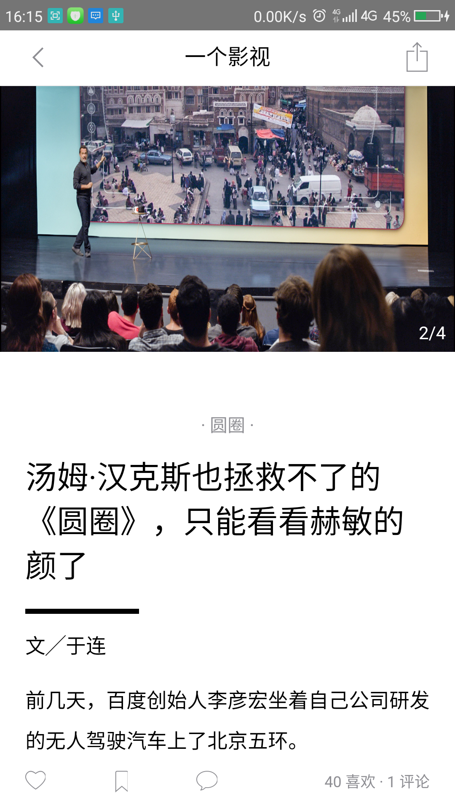

# one-vue
仿韩寒「ONE · 一个」，基于vue2.0+混合式开发的一款跨终端、高性能、用户体验高的移动端App，使用服务端数据接口 [one-api](https://github.com/gongph/one-api) 进行开发。

## 技术架构

- 编译打包工具
  - `webpack@3.0.0`
- 包管理工具
  - `yarn@0.18.1` 还不知道 `yarn` ? 查看[中文文档](https://yarn.bootcss.com/)
- 服务端数据请求
  - `axios@0.16.2`
- 视图组件
  - `vue@2.3.4`
- 状态管理
  - `vuex@2.3.1`
- 路由器
  - Framework7封装的一套自己的[router](http://framework7.io/vue/navigation-router.html)
- 前端UI库
  - `Framework7@1.6.4` [Framework7官网](http://framework7.io)
  - `Framework7-vue@0.9.2`
- 图标库
  - `Framework7-Icons@0.8.9` [Github地址](https://github.com/nolimits4web/Framework7-Icons)

## 项目结构

```bash
.
├── assets
├── media
├── node_modules
├── src
│    ├── api              # 数据接口
│    ├── mixins           # Mixins
│    ├── models
│    ├── pages            # 页面
│    ├── store 
│    │     ├── modules    # 模块
│    │     ├── actions.js # 全局 actions
│    │     ├── getters.js # 全局 getters
│    │     ├── index.js   # 入口文件
│    │     └── mutation-types.js # 类型
│    │
│    ├── utils     # 工具文件夹
│    ├── app.css   # 组件样式
│    ├── app.js    # 入口文件
│    ├── api.vue   # 根组件
│    └── routes.js # 路由配置文件
│
├── build.js       # 编译后的文件
├── index.html
├── mainifest.json # app配置文件，需要配合 HBuilder 开发工具使用
├── package.json
├── webpack.config.js
└── yarn.lock     
```
## 项目截图




## 如何在本地运行？

- 首先你需要安装 [Node.js](http://nodejs.cn/download/)。选择不同版本下载安装即可。如果你安装到其他盘符可能会遇到一些环境变量的奇葩问题。
为了避免此类问题，还是按照默认路径安装吧。
- 安装完 Node ，请按照下面的命令行安装 `yarn` 。这是因为项目模块依赖是用它来管理的，有关 `npm` vs `yarn` 请自行百度。
  ```bash
  # step1: 安装 yarn
  npm i yarn -g
  
  # step2: 安装成功后查看 yarn 版本
  yarn -V
  ```
- 克隆或下载该项目。如果你本地安装了 Git，请使用如下命令行进行克隆，或者你可以下载源码然后解压到本地磁盘。有关  Git 教程，请看[廖雪峰Git教程](http://www.liaoxuefeng.com/wiki/0013739516305929606dd18361248578c67b8067c8c017b000)
  ```bash
  git clone git@github.com:gongph/one-vue.git
  ```
- 安装模块。进入项目根目录打开终端执行如下命令行：
  ```bash
  yarn install
  ```
- 执行如下命令行启动服务，并访问：localhost:8080
  ```bash
  npm run dev
  ```

**注意：** 建议谷歌浏览器调试，调试时请使用手机调试模式查看，快捷键（Ctrl+Shift+M）。

## 如何在真机上运行？

- 首先你需要下载 [HBuilder](http://www.dcloud.io/) 开发工具，然后安装，邮箱注册一下。
- 导入项目。
- 将项目转成 App 项目。点击项目右键 - 成转换移动App
- 手机连接电脑
- 点击工具栏中的运行 - 手机运行 - 选择激活的手机设备，等待片刻即可。

## LICENSE
MIT License

Copyright (c) 2017 [gongph](https://github.com/gongph)
